# Event-RSVP-System

## Core backend Knowledge showing how the data flows through the system

```mermaid
graph LR
    A["🔵 Request"] -->|Client sends data| B["📋 Schema<br/>API Input"]
    B -->|Validates & converts| C["🗄️ ORM<br/>SQLAlchemy"]
    C -->|Converts to SQL| D["🐘 Database<br/>Postgres"]
    D -->|Fetches/Stores data| E["🗄️ ORM<br/>SQLAlchemy"]
    E -->|Converts to Python| F["📋 Schema<br/>API Output"]
    F -->|Serializes data| G["🟢 Response"]
    
    style A fill:#e1f5ff
    style B fill:#fff3e0
    style C fill:#f3e5f5
    style D fill:#e8f5e9
    style E fill:#f3e5f5
    style F fill:#fff3e0
    style G fill:#c8e6c9
```

### Component Breakdown

**🔵 Request** - The incoming HTTP request from the client containing raw JSON or form data.

**📋 Schema (API Input)** - Pydantic schema that validates and deserializes the request data, ensuring it matches expected types and constraints.

**🗄️ ORM (SQLAlchemy)** - The Python object-relational mapper that converts validated data into SQLAlchemy model instances before persisting to the database.

**🐘 Database (Postgres)** - The PostgreSQL database where data is stored, retrieved, and managed with SQL transactions.

**🗄️ ORM (SQLAlchemy)** - Converts raw database records back into Python model instances so the application can work with objects instead of raw SQL rows.

**📋 Schema (API Output)** - Pydantic schema that serializes the ORM model objects into JSON-compatible format, filtering/formatting data for the response.

**🟢 Response** - The final HTTP response sent back to the client with properly formatted JSON data.